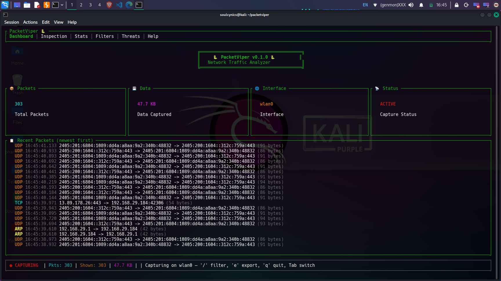
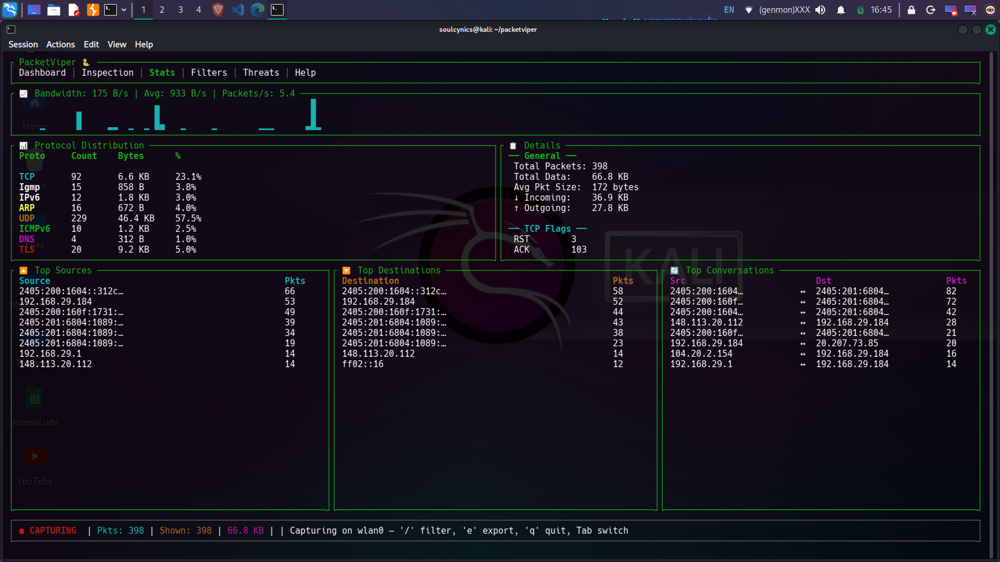
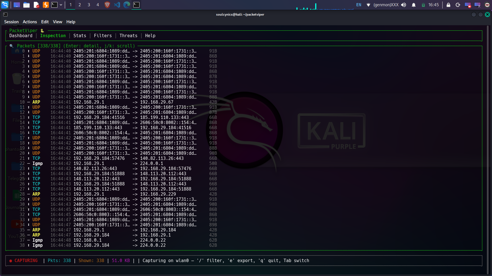
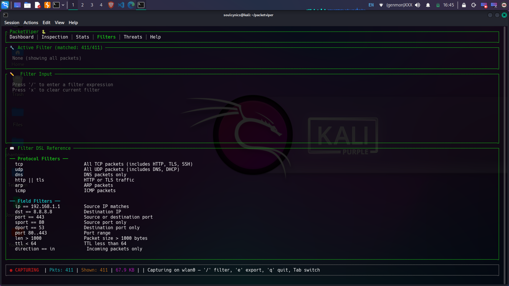
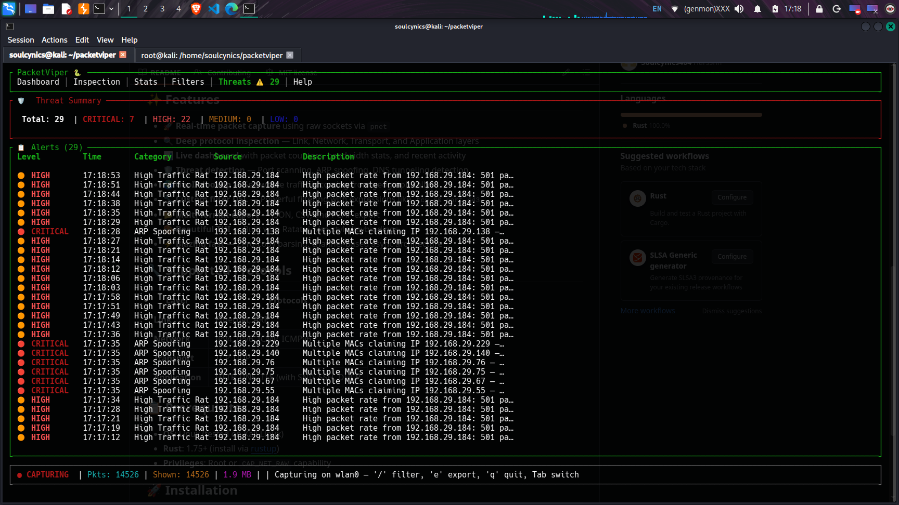
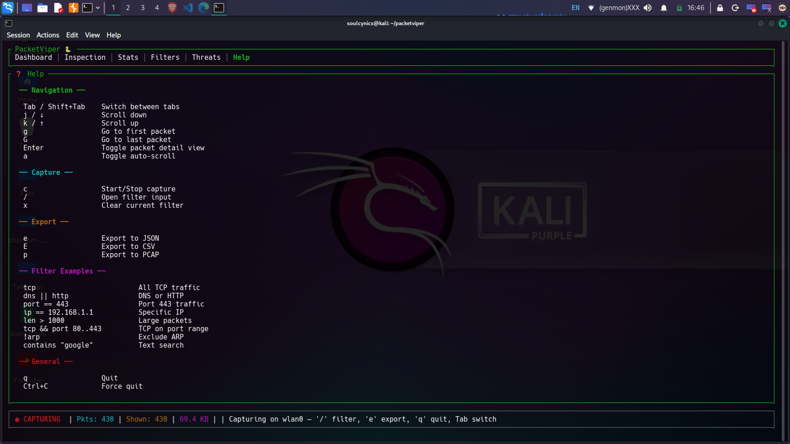

<div align="center">

# 🐍 PacketViper

### A Blazing-Fast TUI Network Traffic Analyzer Built with Rust

[](https://www.rust-lang.org/)
[](LICENSE)
[](https://www.linux.org/)
[](https://github.com/Soulcynics404)


---

*Real-time packet capture, deep protocol inspection, threat detection, and traffic analysis — all from your terminal.*

**PacketViper** is a terminal-based network traffic analyzer designed for cybersecurity professionals, penetration testers, network administrators, and students. It captures live network packets, parses them across all OSI layers (L2–L7), detects active threats like ARP spoofing and port scanning, and provides a rich dashboard with real-time statistics — all without leaving your terminal.

</div>

---

## 📸 Dashboard Preview



<details>
<summary>📊 <b>Stats View</b> — Live bandwidth, protocol distribution, top talkers (click to expand)</summary>
<br>



</details>

<details>
<summary>🔍 <b>Inspection View</b> — Deep packet inspection with hex dump (click to expand)</summary>
<br>



</details>

<details>
<summary>🔧 <b>Filter View</b> — Custom DSL with protocol, IP, port, and compound filters (click to expand)</summary>
<br>



</details>

<details>
<summary>🛡️ <b>Threat Detection</b> — ARP spoofing, port scanning, DNS tunneling detection (click to expand)</summary>
<br>



</details>

<details>
<summary>❓ <b>Help View</b> — Complete keybinding reference (click to expand)</summary>
<br>



</details>

---

## 🎯 Who Is This For?

| Audience | Use Case |
|----------|----------|
| 🔐 **Cybersecurity Students** | Learn packet analysis, understand protocol headers, study network attacks |
| 🕵️ **Penetration Testers** | Monitor attack traffic in real-time, verify ARP spoofing / scanning tools |
| 🌐 **Network Administrators** | Diagnose network issues, monitor bandwidth, identify rogue traffic |
| 🧑‍💻 **Developers** | Debug HTTP/DNS/TLS traffic from applications |
| 📚 **Researchers** | Capture and export traffic datasets for analysis |
| 🏠 **Home Lab Enthusiasts** | Monitor home network for suspicious activity |

---

## ✨ Features

### 🚀 Core Capabilities
- **Real-time packet capture** using raw sockets via `pnet` — no `libpcap` dependency
- **Promiscuous mode** — captures ALL traffic on the network segment
- **Multi-threaded architecture** — capture thread + UI thread with lock-free channels
- **Zero-copy parsing** — efficient packet dissection without unnecessary memory allocation

### 🔬 Deep Protocol Inspection (OSI Layers 2–7)

| OSI Layer | Protocols | Details |
|-----------|-----------|---------|
| **Link (L2)** | Ethernet, ARP | MAC addresses, EtherType, ARP request/reply parsing |
| **Network (L3)** | IPv4, IPv6, ICMP, ICMPv6 | IP addresses, TTL/Hop Limit, flags, DSCP, identification |
| **Transport (L4)** | TCP, UDP | Ports, sequence/ack numbers, all TCP flags (SYN/ACK/FIN/RST/PSH/URG/ECE/CWR), window size |
| **Application (L7)** | HTTP, DNS, TLS, SSH, DHCP, FTP, SMTP, MQTT | HTTP methods/status, DNS queries/answers, TLS version + SNI extraction, SSH version detection |


### 🛡️ Threat Detection Engine

| Threat | Detection Method | Severity |
|--------|-----------------|----------|
| **Port Scanning** | >15 unique destination ports from single source within 60s | 🟠 HIGH |
| **ARP Spoofing** | Multiple MAC addresses claiming same IP via ARP Reply | 🔴 CRITICAL |
| **DNS Tunneling** | DNS query labels >40 characters or total query >100 chars | 🟡 MEDIUM |
| **Suspicious Ports** | Traffic to known malware ports (4444, 31337, 6667, etc.) | 🔵 LOW |
| **DDoS Indicators** | >500 packets in 10 seconds from single source | 🟠 HIGH |

> ✅ **Tested:** Successfully detected ARP spoofing attacks performed with `bettercap` in a live lab environment.
### 🔧 Custom Filter DSL

A powerful domain-specific language for filtering traffic:

#### Protocol Filters

| Filter | Description |
|--------|-------------|
| `tcp` | All TCP packets (includes HTTP, TLS, SSH) |
| `udp` | All UDP packets (includes DNS, DHCP) |
| `dns` | DNS traffic only |
| `http \|\| tls` | HTTP or TLS |
| `arp` | ARP packets |
| `!icmp` | Everything except ICMP |

#### Field Filters

| Filter | Description |
|--------|-------------|
| `ip == 192.168.1.1` | Source IP match |
| `dst == 8.8.8.8` | Destination IP |
| `port == 443` | Source or destination port |
| `sport == 80` | Source port only |
| `dport == 53` | Destination port only |
| `port 80..443` | Port range |
| `len > 1000` | Packet size > 1000 bytes |
| `ttl < 64` | TTL less than 64 |
| `direction == in` | Incoming packets only |

#### Compound Filters

Combine multiple conditions using `&&` (AND) and `||` (OR):

```bash
tcp && port == 443                       # TCP on port 443
(http || dns) && direction == out        # Outbound HTTP or DNS
tcp && len > 500 && dst == 10.0.0.1     # Large TCP to specific IP
contains "google"                        # Text search in packet summary
```

### 📊 Live Statistics Dashboard
- **Bandwidth sparkline graph** — real-time bytes/second visualization
- **Protocol distribution table** — packet count, bytes, and percentage per protocol
- **TCP flag analysis** — SYN, ACK, FIN, RST, PSH breakdown
- **Top sources / destinations / conversations** — ranked by packet count
- **Directional traffic** — incoming vs outgoing byte counters
- **Performance metrics** — packets/second, bytes/second, average packet size

### 📁 Multi-Format Export
- **JSON** — Full packet details with all parsed layer data (`e` key)
- **CSV** — Summary table for spreadsheet analysis (`E` key)
- **PCAP** — Industry-standard format, compatible with Wireshark (`p` key)

### 🎨 Terminal UI (TUI)
- **6 interactive tabs**: Dashboard, Inspection, Stats, Filters, Threats, Help
- **Vim-style navigation** — `j/k` scroll, `g/G` jump, `/` search
- **Packet detail pane** with hex dump view
- **Protocol-colored packet list** — each protocol has a distinct color
- **Auto-scroll** with toggle
- **Live status bar** — capture status, packet count, data volume, active filter

---

## 📋 Prerequisites

| Requirement | Details |
|-------------|---------|
| **Operating System** | Linux (tested on Kali Linux 2024.x) |
| **Rust** | 1.75 or newer [install via rustup](https://rustup.rs/) |
| **System Libraries** | `build-essential`, `libpcap-dev`, `pkg-config` |
| **Privileges** | Root (`sudo`) or `CAP_NET_RAW` + `CAP_NET_ADMIN` capabilities |
| **Terminal** | Any modern terminal emulator with Unicode support |

---

## 🚀 Installation

### Install Dependencies (Debian/Ubuntu/Kali)
```bash
sudo apt update
sudo apt install -y build-essential libpcap-dev pkg-config

## Install Rust (if not already installed)
curl --proto '=https' --tlsv1.2 -sSf https://sh.rustup.rs | sh
source ~/.cargo/env
```

## Build from Source
```
git clone https://github.com/Soulcynics404/packetviper.git
cd packetviper
cargo build --release
```

## Run

### List available network interfaces

```
sudo ./target/release/packetviper
```
### Capture on a specific interface

```
sudo ./target/release/packetviper wlan0    # WiFi
```
```
sudo ./target/release/packetviper eth0     # Ethernet
```

### Alternative: set capabilities to avoid sudo
```
sudo setcap cap_net_raw,cap_net_admin=eip ./target/release/packetviper

./target/release/packetviper wlan0
```

### Data Flow
```bash
┌──────────────────────────────────────────────────┐
│              Terminal UI (Ratatui)               │
│  ┌──────────┐ ┌──────┐ ┌───────┐ ┌──────────┐    │
│  │Dashboard │ │Stats │ │Filter │ │ Threats  │    │
│  └─────┬────┘ └──┬───┘ └──┬────┘ └────┬─────┘    │
│        └─────────┼────────┼────────────┘         │
│  ┌───────────────▼──────────────────────────┐    │
│  │  Main Loop: Drain → Filter → Stats →     │    │
│  │  Threats → Render (50ms tick)            │    │
│  └───────────────┬──────────────────────────┘    │
└──────────────────┼───────────────────────────────┘
                   │ crossbeam-channel (lock-free)
┌──────────────────▼───────────────────────────────┐
│  Capture Thread (pnet raw socket, promiscuous)   │
│  Parse: Ethernet → IP → TCP/UDP → App Layer      │
└──────────────────┬───────────────────────────────┘
           ┌───────▼────────┐
           │  Linux Kernel  │
           └────────────────┘
```

### 📦 Dependencies
- **Crate	              Version                	Purpose**
- **pnet	               0.35	              Raw packet capture and protocol parsing**
- **pnet_datalink	       0.35	              Network interface enumeration**
- **ratatui	           0.28	              Terminal UI framework**
- **crossterm	           0.28	              Terminal manipulation (raw mode, events)**
- **crossbeam-channel	   0.5	              Lock-free multi-producer channels**
- **tokio	               1.0	              Async runtime**
- **chrono	           0.4	              Timestamp handling**
- **serde / serde_json   1.0	              Serialization for JSON export**
- **csv	               1.3	              CSV export**
- **thiserror	           1.0	              Error handling**
- **log / env_logger	   0.4 / 0.11         Logging framework**
- **maxminddb	           0.24	              GeoIP database reader (planned)**
- **dns-lookup	       2.0	              DNS resolution utilities**

---

## 🗺️ Roadmap

- [x] Phase 1: Core capture engine + basic TUI
- [x] Phase 2: All 6 UI tabs, filter DSL, stats, threat detection, export
- [x] Phase 3: GitHub deployment + documentation
- [x] Phase 4: GeoIP integration
- [ ] Phase 5: Packet bookmarking + session save/restore
- [ ] Phase 6: Color themes + UI customization
- [ ] Phase 7: Plugin system for custom protocol parsers
- [ ] Phase 8: TCP stream reassembly
- [ ] Phase 9: More protocols (FTP, SMTP, MQTT, gRPC)
- [ ] Phase 10: Performance benchmarks + optimization

---

## 🧪 Testing

PacketViper has been tested in the following scenarios:

| Test | Tool Used | Result |
|------|-----------|--------|
| ARP Spoofing Detection | `bettercap` | ✅ CRITICAL alert triggered |
| Normal Traffic Capture | Web browsing | ✅ HTTP, DNS, TLS, TCP captured |
| High Traffic Rate | `bettercap` flooding | ✅ HIGH alerts triggered |
| DNS Tunneling Detection | Long DNS queries | ✅ MEDIUM alerts triggered |
| Filter DSL | Various expressions | ✅ Protocol, IP, port, compound filters work |
| Export JSON/CSV/PCAP | Built-in export | ✅ Files generated correctly |

---

## 📄 Documentation

| Document | Description |
|----------|-------------|
| [ARCHITECTURE.md](docs/ARCHITECTURE.md) | System design, data flow, thread model |
| [FEATURES.md](docs/FEATURES.md) | Complete feature list with details |
| [PROJECT_REPORT.md](docs/PROJECT_REPORT.md) | Academic report: threats, limitations, audience, dependencies |
| [CONTRIBUTING.md](docs/CONTRIBUTING.md) | How to contribute |

---

## 🤝 Contributing

See [CONTRIBUTING.md](docs/CONTRIBUTING.md) for guidelines.

---

## 📝 License

This project is licensed under the MIT License — see the [LICENSE](LICENSE) file.

---

## 👤 Author

**Harsshh** — [@Soulcynics404](https://github.com/Soulcynics404)

---

<div align="center">

*Built with ❤️ and Rust for the cybersecurity community*

**⭐ Star this repo if you find it useful!**

</div>