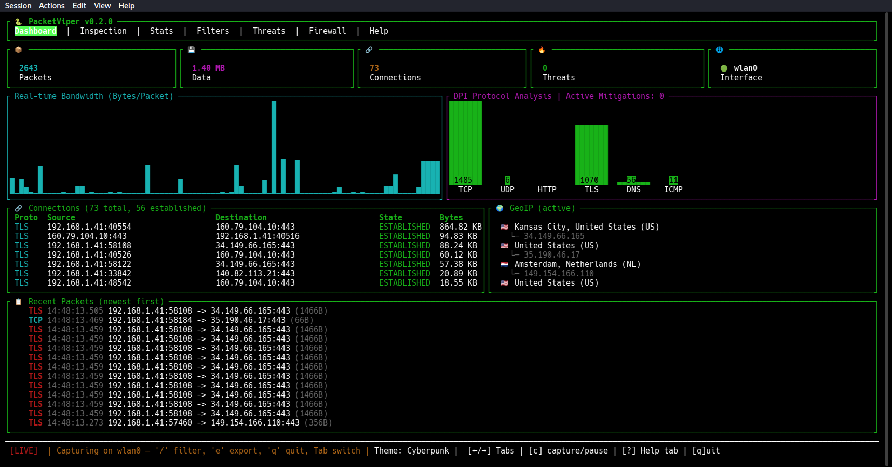
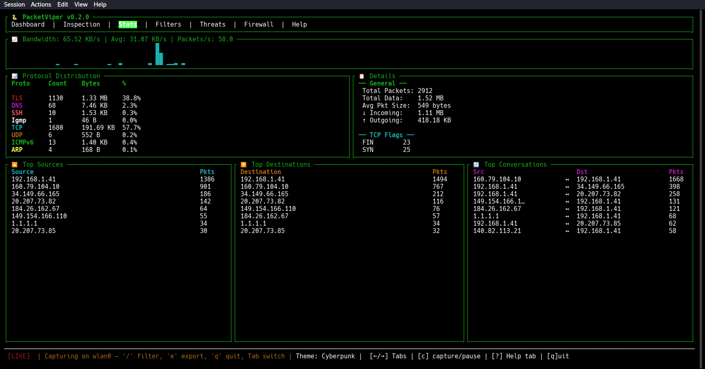
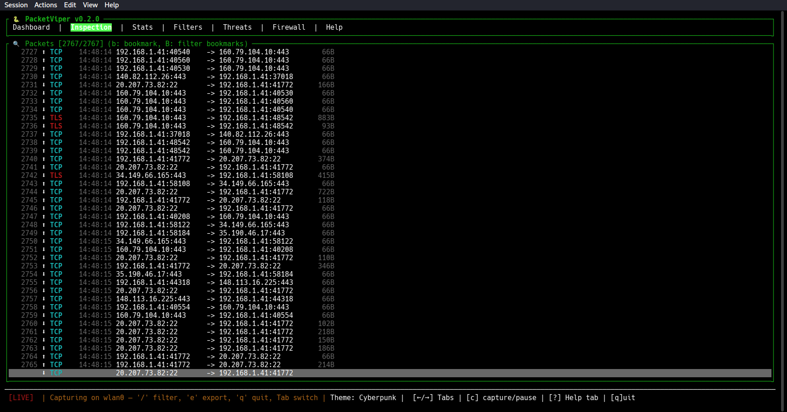
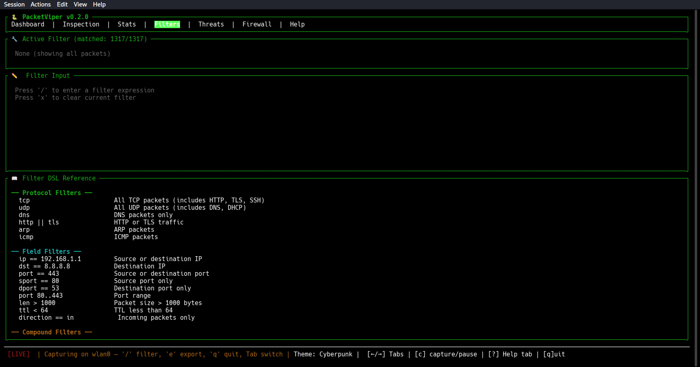
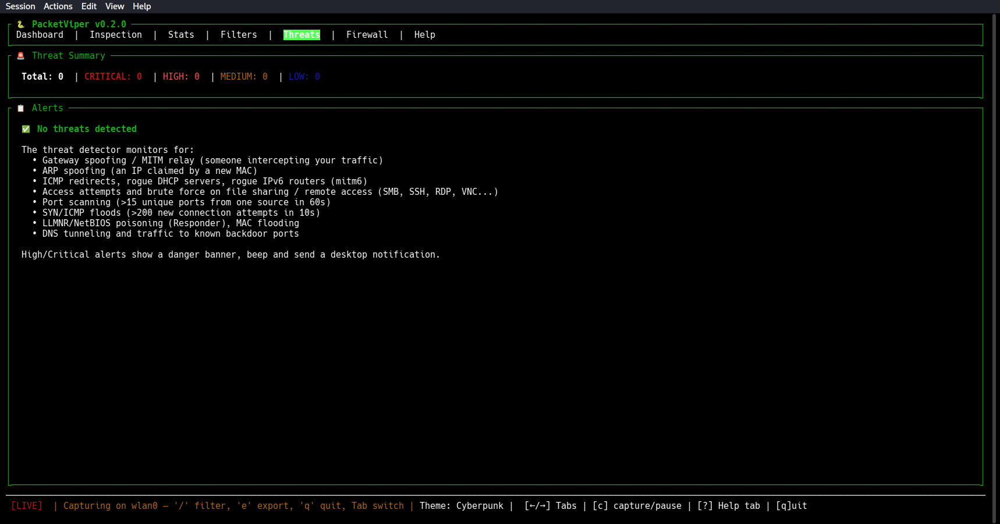
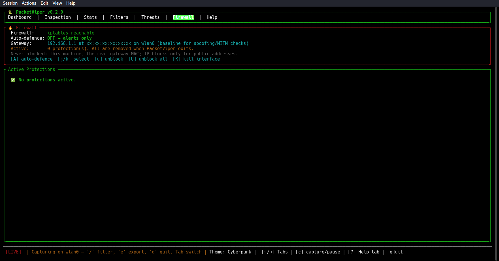
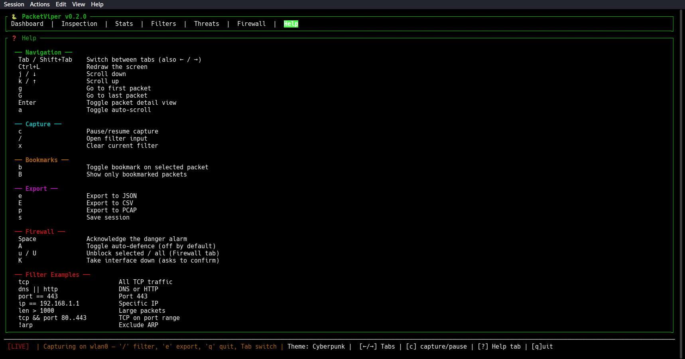

<div align="center">

# 🐍 PacketViper

### A Blazing-Fast TUI Network Traffic Analyzer Built with Rust

[](https://www.rust-lang.org/)
[](LICENSE)
[](#-platform-support)
[](https://github.com/Soulcynics404)


<a href="https://github.com/Soulcynics404/packetviper/releases/latest"></a>


---

*Real-time packet capture, deep protocol inspection, threat detection, and traffic analysis — all from your terminal.*

**PacketViper** is a terminal-based network traffic analyzer designed for cybersecurity professionals, penetration testers, network administrators, and students. It captures live network packets, parses them across all OSI layers (L2–L7), detects active threats like ARP spoofing and port scanning, and provides a rich dashboard with real-time statistics — all without leaving your terminal.

</div>

---

## 📸 Dashboard Preview



<details>
<summary>📊 <b>Stats View</b> — Live bandwidth, protocol distribution, top talkers (click to expand)</summary>
<br>



</details>

<details>
<summary>🔍 <b>Inspection View</b> — Deep packet inspection with hex dump (click to expand)</summary>
<br>



</details>

<details>
<summary>🔧 <b>Filter View</b> — Custom DSL with protocol, IP, port, and compound filters (click to expand)</summary>
<br>



</details>

<details>
<summary>🛡️ <b>Threat Detection</b> — MITM, ARP spoofing, rogue DHCP/IPv6, remote-access attempts, scans and floods (click to expand)</summary>
<br>



</details>

<details>
<summary>🔥 <b>Firewall View</b> — Auto-defence status, gateway baseline, active protections (click to expand)</summary>
<br>



</details>

<details>
<summary>❓ <b>Help View</b> — Complete keybinding reference (click to expand)</summary>
<br>



</details>

---

## 🎯 Who Is This For?

| Audience | Use Case |
|----------|----------|
| 🔐 **Cybersecurity Students** | Learn packet analysis, understand protocol headers, study network attacks |
| 🕵️ **Penetration Testers** | Monitor attack traffic in real-time, verify ARP spoofing / scanning tools |
| 🌐 **Network Administrators** | Diagnose network issues, monitor bandwidth, identify rogue traffic |
| 🧑‍💻 **Developers** | Debug HTTP/DNS/TLS traffic from applications |
| 📚 **Researchers** | Capture and export traffic datasets for analysis |
| 🏠 **Home Lab Enthusiasts** | Monitor home network for suspicious activity |

---

## ✨ Features

### 🚀 Core Capabilities
- **Real-time packet capture** using raw sockets via `pnet` — no `libpcap` dependency
- **Promiscuous mode** — captures ALL traffic on the network segment
- **Multi-threaded architecture** — capture thread + UI thread with lock-free channels
- **Zero-copy parsing** — efficient packet dissection without unnecessary memory allocation

### 🔬 Deep Protocol Inspection (OSI Layers 2–7)

| OSI Layer | Protocols | Details |
|-----------|-----------|---------|
| **Link (L2)** | Ethernet, ARP | MAC addresses, EtherType, ARP request/reply parsing |
| **Network (L3)** | IPv4, IPv6, ICMP, ICMPv6 | IP addresses, TTL/Hop Limit, flags, DSCP, identification |
| **Transport (L4)** | TCP, UDP | Ports, sequence/ack numbers, all TCP flags (SYN/ACK/FIN/RST/PSH/URG/ECE/CWR), window size |
| **Application (L7)** | HTTP, DNS, TLS, SSH, DHCP, FTP, SMTP, MQTT | HTTP methods/status, DNS queries/answers, TLS version + SNI extraction, SSH version detection |


### 🛡️ Threat Detection Engine

High and Critical alerts raise a flashing **⚠ DANGER** banner on every tab, ring the terminal bell and send a desktop notification with sound until you press `Space`.

| Threat | Detection Method | Severity |
|--------|-----------------|----------|
| **Gateway spoofing (MITM)** | A MAC other than your router's claims the router's IP | 🔴 CRITICAL |
| **MITM traffic relay** | Internet traffic reaches you from a MAC other than your router's (ARP-poisoning MITM, evil twin) | 🔴 CRITICAL |
| **ARP spoofing** | An IP claimed by a new MAC (attacker and real MAC named in the alert) | 🟠 HIGH |
| **ICMP redirect** | Someone trying to reroute your traffic | 🟠 HIGH |
| **Rogue DHCP** | DHCP offers from something other than your router | 🟠 HIGH |
| **Rogue IPv6 router / DHCPv6 (mitm6)** | New router advertisements or DHCPv6 servers | 🟠 HIGH / 🟡 MEDIUM |
| **Access to your files / remote control** | Connection attempts to SMB, SSH, FTP, RDP, VNC, NFS, Telnet, WinRM | 🟠 HIGH |
| **Exposed service** | Your PC answered on one of those ports | 🔴 CRITICAL |
| **Brute force** | >10 attempts on one of those ports in 60s | 🔴 CRITICAL |
| **Port scanning** | >15 unique destination ports from one source within 60s | 🟠 HIGH |
| **SYN/ICMP flood** | >200 new connection attempts in 10s from one source (downloads don't count) | 🟠 HIGH |
| **Name poisoning (Responder)** | LLMNR / NetBIOS name answers sent to you | 🟡 MEDIUM |
| **MAC flooding** | >100 different MACs within 10s | 🟡 MEDIUM |
| **DNS tunneling** | DNS query labels >40 characters or total query >100 chars | 🟡 MEDIUM |
| **Suspicious ports** | Traffic to known backdoor ports (4444, 31337, 6667, etc.) | 🔵 LOW |

**Auto-defence** (off by default, toggle with `A`): pins your router's real MAC so you can't be ARP-poisoned, blocks the attacker's MAC (Linux), and blocks public IPs behind floods, scans and brute force. Your own MAC and the router's real MAC are never blocked, and every protection is removed when PacketViper exits. See the **Firewall** tab for what is active.

> ✅ **Tested:** Successfully detected ARP spoofing attacks performed with `bettercap` in a live lab environment.
### 🔧 Custom Filter DSL

A powerful domain-specific language for filtering traffic:

#### Protocol Filters

| Filter | Description |
|--------|-------------|
| `tcp` | All TCP packets (includes HTTP, TLS, SSH) |
| `udp` | All UDP packets (includes DNS, DHCP) |
| `dns` | DNS traffic only |
| `http \|\| tls` | HTTP or TLS |
| `arp` | ARP packets |
| `!icmp` | Everything except ICMP |

#### Field Filters

| Filter | Description |
|--------|-------------|
| `ip == 192.168.1.1` | Source or destination IP |
| `dst == 8.8.8.8` | Destination IP |
| `port == 443` | Source or destination port |
| `sport == 80` | Source port only |
| `dport == 53` | Destination port only |
| `port 80..443` | Port range |
| `len > 1000` | Packet size > 1000 bytes |
| `ttl < 64` | TTL less than 64 |
| `direction == in` | Incoming packets only |

#### Compound Filters

Combine multiple conditions using `&&` (AND) and `||` (OR):

```bash
tcp && port == 443                       # TCP on port 443
(http || dns) && direction == out        # Outbound HTTP or DNS
tcp && len > 500 && dst == 10.0.0.1     # Large TCP to specific IP
contains "google"                        # Text search in packet summary
```

### 📊 Live Statistics Dashboard
- **Bandwidth sparkline graph** — real-time bytes/second visualization
- **Protocol distribution table** — packet count, bytes, and percentage per protocol
- **TCP flag analysis** — SYN, ACK, FIN, RST, PSH breakdown
- **Top sources / destinations / conversations** — ranked by packet count
- **Directional traffic** — incoming vs outgoing byte counters
- **Performance metrics** — packets/second, bytes/second, average packet size

### 📁 Multi-Format Export
- **JSON** — Full packet details with all parsed layer data (`e` key)
- **CSV** — Summary table for spreadsheet analysis (`E` key)
- **PCAP** — Industry-standard format, compatible with Wireshark (`p` key)

### 🎨 Terminal UI (TUI)
- **7 interactive tabs**: Dashboard, Inspection, Stats, Filters, Threats, Firewall, Help
- **5 color themes** — cycle with `t`
- **Vim-style navigation** — `j/k` scroll, `g/G` jump, `/` search
- **Packet detail pane** with hex dump view
- **Protocol-colored packet list** — each protocol has a distinct color
- **Auto-scroll** with toggle
- **Live status bar** — capture status, packet count, data volume, active filter

---

## 💻 Platform Support

| | Linux | Windows 10/11 | macOS |
|---|---|---|---|
| Capture & all detections | ✅ | ✅ (needs [Npcap](https://npcap.com/#download)) | ✅ |
| Danger banner + bell | ✅ | ✅ | ✅ |
| Desktop notification + sound | ✅ `notify-send` | ✅ PowerShell balloon | ✅ Notification Center |
| Block attacker IP | ✅ iptables | ✅ Windows Firewall | ✅ pf |
| Pin router MAC (anti ARP-poisoning) | ✅ `ip neigh` | ✅ `netsh` | ✅ `arp -S` |
| Block attacker MAC | ✅ iptables | ❌ not supported by the OS firewall | ❌ not supported by pf |
| Run as | `sudo` | Administrator | `sudo` |

> Linux is the most tested platform. Windows and macOS support is new; please open an issue if something doesn't work.

---

## 🚀 Installation

### Option 1: Download a ready-made build

Latest release: **[v0.2.1](https://github.com/Soulcynics404/packetviper/releases/tag/v0.2.1)** ([all releases](https://github.com/Soulcynics404/packetviper/releases))

| Platform | Download |
|---|---|
| 🐧 Linux (x86_64) | [packetviper-v0.2.1-x86_64-unknown-linux-gnu.tar.gz](https://github.com/Soulcynics404/packetviper/releases/download/v0.2.1/packetviper-v0.2.1-x86_64-unknown-linux-gnu.tar.gz) |
| 🪟 Windows 10/11 (x86_64) | [packetviper-v0.2.1-x86_64-pc-windows-msvc.zip](https://github.com/Soulcynics404/packetviper/releases/download/v0.2.1/packetviper-v0.2.1-x86_64-pc-windows-msvc.zip) |
| 🍎 macOS Apple Silicon (M1–M4) | [packetviper-v0.2.1-aarch64-apple-darwin.tar.gz](https://github.com/Soulcynics404/packetviper/releases/download/v0.2.1/packetviper-v0.2.1-aarch64-apple-darwin.tar.gz) |
| 🍎 macOS Intel | [packetviper-v0.2.1-x86_64-apple-darwin.tar.gz](https://github.com/Soulcynics404/packetviper/releases/download/v0.2.1/packetviper-v0.2.1-x86_64-apple-darwin.tar.gz) |

Extract the archive and run `packetviper` (or `packetviper.exe`) as shown in [Run](#run).

```bash
# Linux / macOS example
tar xzf packetviper-v0.2.1-x86_64-unknown-linux-gnu.tar.gz
cd packetviper-v0.2.1-x86_64-unknown-linux-gnu
sudo ./packetviper            # list interfaces
sudo ./packetviper wlan0      # start capturing
```

- **macOS:** the first run may be blocked by Gatekeeper because the binary isn't signed. Allow it in **System Settings → Privacy & Security**, or run `xattr -d com.apple.quarantine ./packetviper`.

- **Windows:** first install [Npcap](https://npcap.com/#download) and tick **"Install Npcap in WinPcap API-compatible Mode"**.

### Option 2: Build from source

Install Rust 1.75 or newer from [rustup.rs](https://rustup.rs/), then:

```bash
git clone https://github.com/Soulcynics404/packetviper.git
cd packetviper
cargo build --release
```

- **Linux (Debian/Ubuntu/Kali):** `sudo apt install -y build-essential pkg-config` first.
- **macOS:** `xcode-select --install` first.
- **Windows:** install [Npcap](https://npcap.com/#download) (WinPcap API-compatible mode), download the **Npcap SDK** from the same page, and point the linker at it before building:
  ```powershell
  $env:LIB = "C:\path\to\npcap-sdk\Lib\x64"
  cargo build --release
  ```

## Run

List interfaces, then capture on one:

```bash
# Linux
sudo ./target/release/packetviper
sudo ./target/release/packetviper wlan0

# macOS
sudo ./target/release/packetviper
sudo ./target/release/packetviper en0
```

```powershell
# Windows: open PowerShell as Administrator
.\target\release\packetviper.exe
.\target\release\packetviper.exe "\Device\NPF_{YOUR-ADAPTER-GUID}"
```

Each run writes a log to `logs/packetviper_<date>_<time>.log` with every alert and firewall action.

> **Linux tip:** `sudo setcap cap_net_raw=eip ./target/release/packetviper` lets you capture without sudo, but auto-defence and `K` still need root.

## 📱 Phone dashboard & remote alerts

PacketViper serves a mobile dashboard so your phone sees live status and gets danger alerts.

- **Same Wi-Fi (built in):** press `o` in the TUI (or read the `serve` output) for a QR + link. Open it on your phone — big SAFE/DANGER banner that flashes, beeps and vibrates, live speed, top uploading apps, alerts, and (optionally) controls to toggle autosave/auto-defence and the ring size. Access is gated by a per-run token in the link.
- **Anywhere (optional relay):** run the tiny `packetviper-relay` on a server (an **AWS free-tier `t2.micro`/`t3.micro` is plenty**) so alerts reach your phone on mobile data too.

### Deploy the relay (AWS free tier)

```bash
# On the EC2 instance (Amazon Linux/Ubuntu), with Rust installed:
git clone https://github.com/Soulcynics404/packetviper.git && cd packetviper
cargo build --release -p packetviper-relay
./target/release/packetviper-relay 9000        # or: PORT=9000 ./packetviper-relay
```

- Open port **9000** in the instance's **Security Group** (inbound).
- Keep it running with systemd, e.g. `ExecStart=/path/packetviper-relay 9000`, `Restart=always`.

On the **laptop**, set in `packetviper-config.json` (created on first run):

```json
{ "relay_enabled": true, "relay_url": "http://<EC2-PUBLIC-IP>:9000" }
```

Restart PacketViper. A pair code is generated and saved automatically; press `o` to get the "open from anywhere" QR/link for your phone.

> **Security:** the relay uses plain HTTP, so the pair code and the summary data (no packet contents — just counts, rates, alert text, app names, IPs) travel unencrypted. For real use, front the relay with HTTPS (e.g. **Caddy**, which gets a free certificate automatically) or, simplest and fully encrypted with **no relay code at all**, use a reverse SSH tunnel:
> ```bash
> # exposes your laptop's LAN dashboard via the EC2 box, encrypted over SSH:
> ssh -R 0.0.0.0:8080:localhost:7373 user@<EC2-PUBLIC-IP>
> # then open  http://<EC2-PUBLIC-IP>:8080/?t=<token from the o screen>
> ```
> Treat the pair code / token like a password.

### Data Flow
```bash
┌──────────────────────────────────────────────────┐
│              Terminal UI (Ratatui)               │
│  ┌──────────┐ ┌──────┐ ┌───────┐ ┌──────────┐    │
│  │Dashboard │ │Stats │ │Filter │ │ Threats  │    │
│  └─────┬────┘ └──┬───┘ └──┬────┘ └────┬─────┘    │
│        └─────────┼────────┼────────────┘         │
│  ┌───────────────▼──────────────────────────┐    │
│  │  Main Loop: Drain → Filter → Stats →     │    │
│  │  Threats → Render (50ms tick)            │    │
│  └───────────────┬──────────────────────────┘    │
└──────────────────┼───────────────────────────────┘
                   │ crossbeam-channel (lock-free)
┌──────────────────▼───────────────────────────────┐
│  Capture Thread (pnet raw socket, promiscuous)   │
│  Parse: Ethernet → IP → TCP/UDP → App Layer      │
└──────────────────┬───────────────────────────────┘
           ┌───────▼────────┐
           │  Linux Kernel  │
           └────────────────┘
```

### 📦 Dependencies
- **Crate	              Version                	Purpose**
- **pnet	               0.35	              Raw packet capture and protocol parsing**
- **pnet_datalink	       0.35	              Network interface enumeration**
- **ratatui	           0.28	              Terminal UI framework**
- **crossterm	           0.28	              Terminal manipulation (raw mode, events)**
- **crossbeam-channel	   0.5	              Lock-free multi-producer channels**
- **tokio	               1.0	              Async runtime**
- **chrono	           0.4	              Timestamp handling**
- **serde / serde_json   1.0	              Serialization for JSON export**
- **csv	               1.3	              CSV export**
- **thiserror	           1.0	              Error handling**
- **log / env_logger	   0.4 / 0.11         Logging framework**
- **maxminddb	           0.24	              GeoIP database reader (planned)**
- **dns-lookup	       2.0	              DNS resolution utilities**

---

## 🗺️ Roadmap

- [x] Phase 1: Core capture engine + basic TUI
- [x] Phase 2: All 6 UI tabs, filter DSL, stats, threat detection, export
- [x] Phase 3: GitHub deployment + documentation
- [x] Phase 4: GeoIP integration
- [x] Phase 5: Packet bookmarking + session save/restore
- [x] Phase 6: Color themes + UI customization
- [x] Phase 7: Plugin system for custom protocol parsers
- [x] Phase 8: TCP stream reassembly
- [x] Phase 9: More protocols (FTP, SMTP, MQTT, gRPC)
- [x] Phase 10: Final polish + documentation

---

## 🧪 Testing

PacketViper has been tested in the following scenarios:

| Test | Tool Used | Result |
|------|-----------|--------|
| ARP Spoofing Detection | `bettercap` | ✅ CRITICAL alert triggered |
| Normal Traffic Capture | Web browsing | ✅ HTTP, DNS, TLS, TCP captured |
| High Traffic Rate | `bettercap` flooding | ✅ HIGH alerts triggered |
| DNS Tunneling Detection | Long DNS queries | ✅ MEDIUM alerts triggered |
| Filter DSL | Various expressions | ✅ Protocol, IP, port, compound filters work |
| Export JSON/CSV/PCAP | Built-in export | ✅ Files generated correctly |

---

## 📄 Documentation

| Document | Description |
|----------|-------------|
| [ARCHITECTURE.md](docs/ARCHITECTURE.md) | System design, data flow, thread model |
| [FEATURES.md](docs/FEATURES.md) | Complete feature list with details |
| [PROJECT_REPORT.md](docs/PROJECT_REPORT.md) | Academic report: threats, limitations, audience, dependencies |
| [CONTRIBUTING.md](docs/CONTRIBUTING.md) | How to contribute |

---

## 🤝 Contributing

See [CONTRIBUTING.md](docs/CONTRIBUTING.md) for guidelines.

---

## 📝 License

This project is licensed under the MIT License — see the [LICENSE](LICENSE) file.

---

## 👤 Author

**Harsshh** — [@Soulcynics404](https://github.com/Soulcynics404)

---

<div align="center">

*Built with ❤️ and Rust for the cybersecurity community*

**⭐ Star this repo if you find it useful!**

</div>
